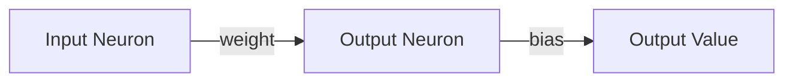

# 🧠 73NeuralNetwork

> **A modern, minimalist neural network built from scratch in Python.**  
> 🚀 Designed for learning how neural networks work step by step.

---

## 📚 Overview

**73NeuralNetwork** is an educational project that implements a simple neural network using pure Python and NumPy. It is perfect for newcomers and curious minds who want to peek under the hood of neural computation and see how neurons, connections, activations, and training algorithms interact.

---

## 🦾 Features

- **📝 Clean & Readable Code:** Every class and method is easy to follow.
- **🔀 Custom Layers:** Define your network architecture manually for complete transparency.
- **🌈 Multiple Activation Functions:** Includes ReLU, LeakyReLU, Sigmoid, Binary, Sign.
- **🏋️‍♂️ Simple Training Loop:** Basic approach for updating weights & biases.
- **🌎 English variable names:** Clear and consistent for global audiences.
- **💡 Extensible:** Tweak, extend, or use as a sandbox for your neural innovations.

---

## 🏗️ Architecture

- **Neuron (`Neuron`)**: Stores a value, a bias, and a list of input connections.
- **Connection (`Connection`)**: Represents a weighted link to another neuron.
- **Model (`Model`)**: Holds the network, defines activation behavior, and manages training/prediction.



---

## ⚙️ How Does It Work?

1. **Initialization:**  
   - You manually assemble neurons and link them through connections, configuring weights and biases.

2. **Forward Pass (Prediction):**  
   - Inputs travel from the first layer through the network, activating each neuron via weighted sums and a chosen activation function.

3. **Training Loop:**  
   - For many epochs, the network compares its output to the expected output and tweaks weights and biases according to error.
   - Basic gradient-like update (not full backpropagation yet).

4. **Activation Functions:**
   - 🌟 **ReLU**: `max(0, x)`
   - ⚡️ **LeakyReLU**: `x if x > 0 else 0.01 * x`
   - 🕸️ **Sigmoid**: `1 / (1 + exp(-x))`
   - 🔘 **Binary**: `0 if x <= 0 else 1`
   - ➕ **Sign**: `-1 if x <= 0 else 1`

---

## 🚀 Example: Celsius to Fahrenheit

```python
from main import Neuron, Connection, Model
import numpy as np

# Create neurons
n1 = Neuron()
n2 = Neuron(np.random.uniform(-1,1))

# Connect neurons
n2.inputs = [Connection(np.random.uniform(-1,1), n1)]

# Build the model
model = Model([
    [n1],
    [n2],
], "LeakyReLU")

# Train for temperature conversion
dataset = [([c], ((c * (9/5)) + 32)) for c in range(500)]
model.train(dataset, epochs=1000, learning_rate_w=0.000001, learning_rate_b=0.001)

print("Training complete!")
print(f"10°C → {model.predict([10]).value:.2f}°F")
print(f"35°C → {model.predict([35]).value:.2f}°F")
```

---

## 📁 File Structure

```
main.py     # All the neural network logic and classes
README.md   # This documentation
```

---

## 🧑‍💻 For Learners

- **Code is step-by-step:** Great to see how each piece works, and experiment on your own.
- **Change activation functions, learning rates, or architectures to see how learning changes.**
- **Add hidden layers, new connections, or upgrade to full backpropagation as your next challenge!**

---

## 💡 To Improve (Ideas!)

- Add support for multiple outputs/neuron layers.
- Integrate graphs to visualize learning progress.
- Integrate Adam optimization algorithm to estimate the learning rate.
---

## 📜 License

MIT License. Free to use, hack, and share.

---

## 🤝 Contributing

Suggestions, issues, and PRs are welcome!  
Open an [issue](https://github.com/xe-4f14-5d3-6s2/73neuralnetwork/issues) or [pull request](https://github.com/xe-4f14-5d3-6s2/73neuralnetwork/pulls).

---

## 🌐 Author

Made with ❤️ by [@xe-4f14-5d3-6s2](https://github.com/xe-4f14-5d3-6s2)

---

```
🧠 Keep experimenting — and happy neural coding!
```